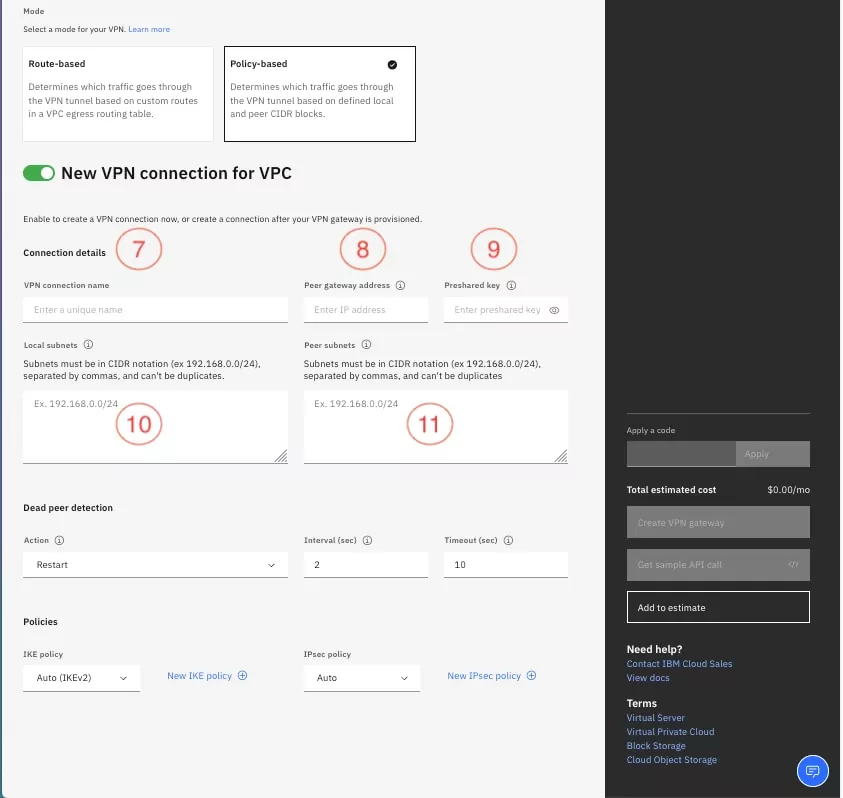

# Power to On-prem through VPC

Today, we are going to deploy this architecture:


**What is [PowerVS](https://cloud.ibm.com/docs/power-iaas?topic=power-iaas-getting-started)?**
- IBM® Power® Virtual Server is an IBM Power server offering. You can use the Power Virtual Server to deploy a virtual server, also known as a logical partition (LPAR), in a matter of minutes. You can provision flexible, secure, and scalable compute capacity for Power enterprise workloads both on IBM Power Virtual Server (Off-premises and On-premises) in your data center.

**What is [strongSwan](https://docs.strongswan.org/docs/5.9/howtos/introduction.html)?**
- strongSwan is a complete IPsec solution providing encryption and authentication to servers and clients. strongSwan can be used to secure communications with remote networks, so that connecting remotely is the same as connecting locally.


## 1. Create both VPCs

One VPC will be on-premise-like (the one in Washington DC in this case)

The other one will be the "gateway", it will host the VPN and Transit gateway, and manage all the traffic/routes between the on-premise-like VPC and the PowerVS Workspace.

## 2. Create the VSIs

Later on, assign a floating IP to the on-prem VSI.

## 3. Create a Power Workspace

1. To get started, [create a power workspace](https://cloud.ibm.com/power/create-workspace)

The workspace must be in the **same region** as the VPC (not the on-prem-like), because we will create a local Transit Gateway.

2. Create a subnet inside the workspace (you must choose an IP's range that doesn't overlap with the VPC subnet and the On-prem subnet ranges)

3. Create the VSI in the workspace. Don't forget to assign the VSI to the subnet.

## 4. Create the Transit Gateway

[Create the Transit Gateway](https://cloud.ibm.com/interconnectivity/transit/provision) that will connect the VPC and the Power Workspace

1. For Location, choose the region of the **VPC and Power Workspace**
2. In connections:
    - Create a connection to **VPC**, select your VPC.
    - Create a connection to **Power Systems Virtual Server**, select your Power Workspace.

## 5. Create the Route table

This route table allows the traffic from the Transit Gateway reach the On-prem subnet.

[Create the Route Table](https://cloud.ibm.com/vpc-ext/provision/routingTable)

1. In Location, select the region of your VPC.
1. In Details, select your VPC (not the on-prem)
1. In Traffic, activate:
    - VPN Server
    - VPN Gateway
    - Transit Gateway. You **must** activate the `announce to` option

Don't add any routes, Transit Gateway will do the job.

## 6. Create the VPN

[Create a VPN gateway for VPC](https://cloud.ibm.com/vpc-ext/provision/vpngateway)

1. Enter a name for your VPN.
2. Select your resource group.
3. Select the region that your VPC is in.
4. Select your VPC.
5. Select the subnet.



6. For mode, select **Policy-Based** 
7. Give the connection a name, such as **on-prem**. 
8. In the peer gateway address field, enter the public IP address of your home network. You can usually find this in the network settings of your home router.  
9. In the pre-shared key field, enter any string of the appropriate size. Just remember what you enter here because you will need it later on.
10. In the local subnets field, enter the IP address range of your VPC subnet and the Cloud Service Endpoint subnet constant value of 166.8.0.0/14, separated by a comma.

    1. Example: 10.241.128.0/18,166.8.0.0/14
    2. Note that even though you previously selected the subnet on this form, that subnet information is not carried through to the connection, so you have to enter it again in this field.

11. In the Peer subnets field, enter your home network CIDR. For example, 192.168.1.0/24.
12. Click the Create VPN Gateway button to create the VPN and the VPN connection. Note that the VPN connection will show as down until the Home network side is configured.
13. After the VPN Gateway is created, make a note of the public VPN gateway IP address.

> Source: [Guide](https://www.ibm.com/blog/setting-up-a-vpn-between-ibm-cloud-vpc-and-your-home-office/)

## 7. Configure strongSwan

Now, you have to SSH to the on-prem VSI.
Run the following commands to configure strongSwan.

1. Install strongSwan
`$ sudo apt-get install strongswan`

> [Install guide to non-linux users](https://docs.strongswan.org/docs/5.9/install/install.html)

2. Open `/etc/sysctl.conf` in a text editor and add/uncomment the following line: 
`net.ipv4.ip_forward = 1`

3. Save and close the file
4. Apply changes with the following command:
`$ sudo sysctl -p`

5. Open `/etc/ipsec.conf` in a text editor and add:

> Left is on-prem side. Right is IBM side
```
conn %default                               #<- %default means it affects all connections
        type=tunnel
        auto=route
        esp=aes256-sha256!
        ike=aes256-sha256-modp2048!
        left=%all                           #<- IPs that will connect after the on-prem gateway (could be the same as leftid but without "")
        leftsubnet=x.x.x.x/x            #<- On-prem subnet
        leftauth=psk
        rightauth=psk
        keyexchange=ikev2
        leftid="y.y.y.y"            #<- On-prem gateway (the strongSwan VSI public IP)
        lifetime=10800s
        ikelifetime=36000s
        dpddelay=30s
        dpdaction=restart
        dpdtimeout=120s

conn ibm-cloud-subnet-conn                  #<- Name of the connection, can be anything
        rightsubnet=i.i.i.i/i,j.j.j.j/j           #<- Subnets on IBM's side (VPC subnet and Power subnet), you have to separate them with a comma
        right=w.w.w.w                #<- VPN Gateway public IP
        rightid="w.w.w.w"            #<- Same as right but with ""
```

6. Open `/etc/ipsec.secrets` in a text editor and add:

```
    leftsideid rightsideid : PSK "your secret key"
```

> Change leftsideid and rightsideid with the IPs. And add your PSK (Pre-shared key) here.

7. Establish the VPN Connection:
    - Run: `sudo ipsec start && sudo ipsec status`. The output looks similar to this:
    


> If you need to make changes to any config files, run `sudo ipsec restart`.

8. Verify the connection:


## 8. Enjoy!

## Thank you!

> For improvements or fixes: Pull Request the repo, or contact me via Mail/Linkedin
