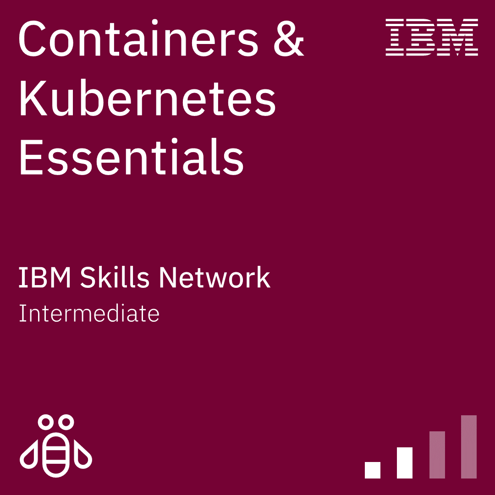
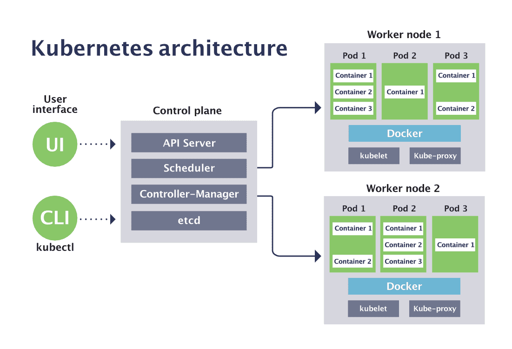
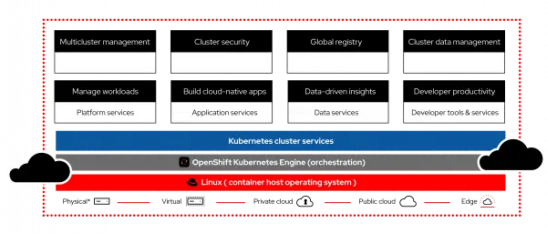
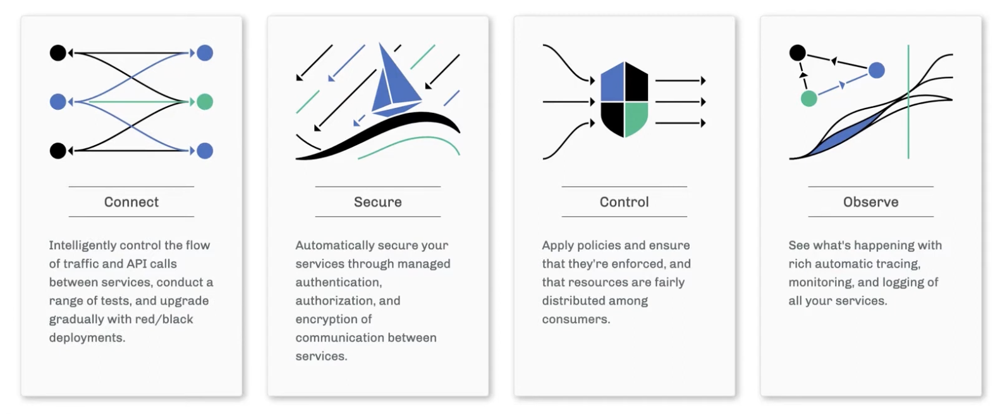
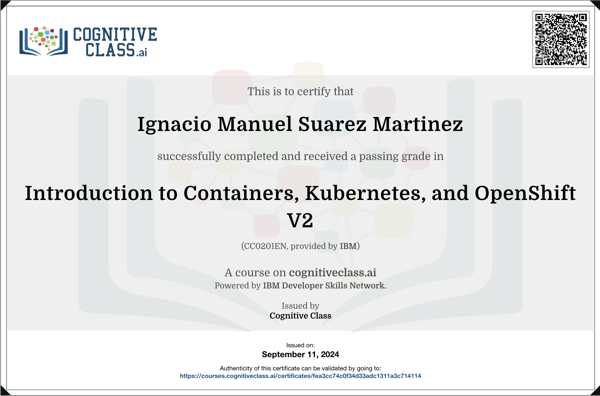

## Archivo creado por Ignacio Suárez

#### Curso: [Introduction to Containers, Kubernetes, and OpenShift V3](https://cognitiveclass.ai/courses/kubernetes-course)
#### Badge IBM: [Containers & Kubernetes Essentials](https://yourlearning.ibm.com/credential/CREDLY-5eef1a66-1a37-42cc-940a-e7160661810a)

##### Comienzo: 10/09/24
##### Finalizado: 11/09/24

**Docker** es un proyecto de código abierto que automatiza el despliegue de aplicaciones dentro de contenedores de software, proporcionando una capa adicional de abstracción y automatización de virtualización de aplicaciones en múltiples sistemas operativos. 
Se encarga de crear y manejar los contenedores a niveles individuales.

> Algunos comandos de Docker son:
* `docker build`: para construir una imagen a partir de una dockerfile.
* `docker pull`: para tomar una imagen de un registro y guardarla localmente.
* `docker push`: para subir una imagen desde local hacia un registro.
* `docker run`: crea un contenedor a partir de una imagen y lo corre.
* `docker stop`: detiene un contenedor en ejecución.
* `docker ps`: lista todos los contenedores.
* `docker images`: lista todas las imágenes.

> Ciertos conceptos!

##### *Imágenes / Image*
Son plantillas que solo se pueden leer, contienen las instrucciones para la creación de un contenedor. Estás plantillas son las que contienen las librerías y dependencias requeridas por una aplicación para poder correr. Son básicamente una snapshot de un contenedor.

##### *Contenedores / Container*
Un contenedor es un entorno de ejecución que contiene todos los componentes necesarios para que una aplicación pueda correr, sin necesidad de utilizar dependencias de la máquina host.
Básicamente empaqueta una aplicación para que se ejecute en cualquier sistema destino.
Los contenedores son altamente portables y muy ligeros, debido a que no requieren empaquetar todo un sistema operativo dentro, como en el caso de las VM.

##### *Contenedorización / Containerization*
La contenedorización permite que una aplicación de software se ejecute como microservicio en arquitecturas de hardware distribuidas y multiplataformas.

###### Sources:
- [Image, container and containerization](https://aws.amazon.com/es/compare/the-difference-between-docker-images-and-containers/?nc1=h_ls)
- [Comandos de Docker](https://blog.rocketseat.com.br/comandos-docker-mais-utilizados/)
> En la documentación oficial podrás encontrar más y mejor información.

--------

**Kubernetes** es un orquestador de contenedores, se encarga de automatizar la implementación, escalado y administración de contenedores.

**Arquitectura de Kubernetes.**

> Algunos comandos de Kubernetes son:
* `kubectl cluster-info`: permite obtener la info del clúster.
* `kubectl get nodes`: lista los nodos del clúster.
* `kubectl get pods`: lista los pods del clúster
* `kubectl scale`: permite escalar un deployment a un número X de réplicas.
* `kubectl apply`: aplica el contenido de un fichero YAML.
* `kubectl delete`: permite borrar un objeto.

> Ciertos conceptos!

##### *Clústers*
Un clústers es lo que se puede ver en la arquitectura de arriba. Consiste en un plano de control, y uno, o varios, nodos de trabajo.
También posee una interfaz de usuario (que comparada con la de OpenShift, es más primitiva (dato no checkeado)) y una CLI llamada Kubectl (se pronuncia kube control)

##### *Plano de control*
Controla el estado en general del clúster. Tiene varios componentes:
- **Kube-apiserver**: El componente núcleo, este expone la API de Kubernetes. Se trata del frontend de Kubernetes, recibe las peticiones y actualiza acordemente el estado en etcd.
- **Kube-scheduler**: Está pendiente de los *Pods* que no tienen ningún *nodo* asignado y selecciona uno donde ejecutarlo. Tiene en cuenta diversos factores a la hora de decidir donde se ejecutará cada *Pod*.
- **kube-controller-manager**: Se encarga de ejecutar los controladores de Kubernetes (los controladores son bucles de control que observan el estado del *clúster*, y ejecutan o solicitan los cambios que sean necesarios para alcanzar el estado deseado). Existen varios tipos de controladores, más info en el link de source.
- **cloud-controller-manager**: Ejecuta controladores que interactúan con proveedores en la nube. Este componente permite que el código de Kubernetes y el del proveedor de la nube evolucionen de manera independiente. Anteriormente, Kubernetes dependía de la funcionalidad específica de cada proveedor de la nube.

##### *Nodos*
Los nodos son las máquinas que realizan el trabajo de correr los contenedores, estos tienen varios componentes:
- **kubelet**: Agente que se ejecuta en cada nodo de un clúster. Se asegura de que los contenedores estén corriendo en un pod. El agente kubelet toma un conjunto de especificaciones de Pod, llamados PodSpecs, que han sido creados por Kubernetes y garantiza que los contenedores descritos en ellos estén funcionando y en buen estado.
- **kube-proxy**: Permite abstraer un servicio en Kubernetes manteniendo las reglas de red en el anfitrión y haciendo reenvío de conexiones.
- **Runtime de contenedores**: El runtime de los contenedores es el software responsable de ejecutar los contenedores. Kubernetes soporta varios de ellos: Docker, containerd, cri-o, rktlet y cualquier implementación de la interfaz de runtime de contenedores de Kubernetes, o Kubernetes CRI.

###### Sources:
- [Componentes de Kubernetes (Oficial)](https://kubernetes.io/es/docs/concepts/overview/components/)
- [Comandos básicos de Kubernetes](https://www.occentus.net/documentacion/comandos-basicos-kubernetes/)

----------

**Red Hat OpenShift** es una extensión de Kubernetes, pero con muchas funciones y servicios adicionales que permiten construir, lanzar y correr aplicaciones seguras y escalables, ya sea en la nube u on-premise. Tiene a Kubernetes como parte interior.

Kubernetes es un proyecto que ofrece mucha libertad al usuario, es el usuario quien debe elegir como y de que manera asociarlo a los demas servicios para la creación segura y escalable de aplicaciones mediante contenedores.
OpenShift sin embargo, tiene una visión más dogmática, te provee de servicios predeterminados para que el usuario no pase tiempo viendo con cual servicio asociarlo dependiendo de su caso de uso. Este sistema permite una mejor agilidad en la creación de las aplicaciones mediante contenedores, sin embargo, no provee el 100% de personalización que tiene Kubernetes.

**Arquitectura de OpenShift.**

###### Sources:
- [Red Hat OpenShift](https://www.redhat.com/es/technologies/cloud-computing/openshift)

--------

**Istio** amplía Kubernetes para establecer una red programable y consciente de las aplicaciones. Al trabajar tanto con Kubernetes como con cargas de trabajo tradicionales, Istio aporta gestión de tráfico, telemetría y seguridad estándar y universal a despliegues complejos.

**Beneficios de Istio.**

###### Sources:
- [Video del curso sobre Istio](https://www.youtube.com/watch?v=pUWkGylEYeM)

-------

## Insigna en [Credly](https://www.credly.com/badges/84472ae0-f4d2-4c11-b584-47b8a8dba6e8)

## [Certificado](https://courses.cognitiveclass.ai/certificates/fea3cc74c0f34d33adc1311a3c714114) de completitud
